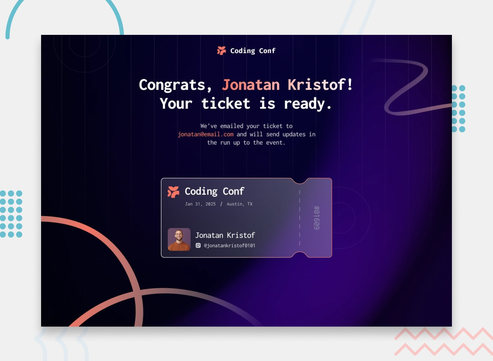

# 🚀 Desafios Frontend Mentor

## Escolha o seu desafio!

Abaixo estão os **3 desafios** disponíveis. Escolha **um** deles para praticar suas habilidades de front-end. Cada desafio possui uma prévia visual para facilitar sua escolha.

---

### 1. 🎫 Gerador de Ingresso para Conferência

**Dificuldade:** Iniciante a Intermediário | **Tecnologias:** HTML, CSS *(JavaScript opcional)*

Construa um gerador de ingresso para conferência com formulário e layout responsivo. A geração dinâmica do ingresso com JavaScript é um **desafio bônus opcional** — o ingresso pode ser construído como um elemento estático com HTML + CSS.

📁 [**Acessar desafio →**](./conference-ticket-generator-main/)

---

### 2. 🛒 Card de Resumo do Pedido

**Dificuldade:** Iniciante | **Tecnologias:** HTML, CSS

Construa um componente de card de resumo do pedido com estados de hover interativos.

📁 [**Acessar desafio →**](./order-summary-component-main/)

---

### 3. 📊 Componente de Card de Prévia de Estatísticas

**Dificuldade:** Iniciante | **Tecnologias:** HTML, CSS

Construa um componente de card com prévia de estatísticas e layout responsivo.

📁 [**Acessar desafio →**](./stats-preview-card-component-main/)

---

## Como funciona?

1. **Escolha** um dos desafios acima
2. **Abra** a pasta do desafio escolhido
3. **Leia** o `README.md` do desafio para entender os requisitos
4. **Consulte** o `style-guide.md` para cores, fontes e tamanhos
5. **Implemente** sua solução usando HTML, CSS e (opcionalmente) JavaScript
6. **Compare** com os designs na pasta `/design`

## Dicas

- Cada desafio contém designs para **mobile** e **desktop** na pasta `/design`
- Os recursos (imagens, fontes) já estão incluídos em cada projeto
- Use o `style-guide.md` como referência para cores e tipografia
- Sinta-se livre para usar qualquer ferramenta ou framework que quiser praticar

---

**Boa sorte e divirta-se construindo!** 🎉

---

## 📌 Fonte dos Desafios

Os desafios acima foram criados por [Frontend Mentor](https://www.frontendmentor.io/). Visite a plataforma para encontrar mais desafios de front-end de diferentes níveis de dificuldade.
